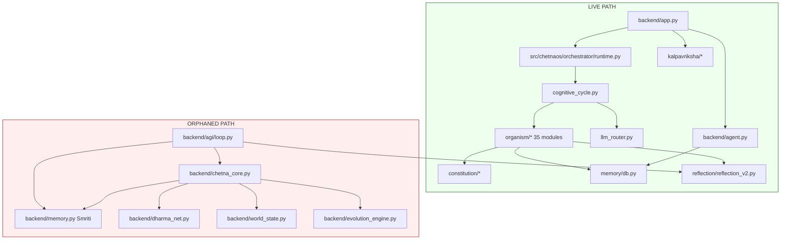

# 02 — Dependency Graph

**Analysis date:** 2026-06-15  
**Method:** AST import extraction from 93 Python files

---

## A. Architecture Layers (observed)



---

## B. Internal Import Edges (complete)

```
backend.app
  → backend.config
  → backend.api
  → backend.agent
  → src.chetnaos.orchestrator.runtime  [lazy]

backend.agent
  → memory.db

backend.api
  → kalpavriksha.evaluator
  → kalpavriksha.roi
  → kalpavriksha.crop_planner

backend.agi.loop                    [ORPHANED]
  → backend.chetna_core
  → reflection.reflection_v2
  → backend.agi.memory_service
  → backend.agi.types

backend.agi.memory_service          [ORPHANED]
  → backend.memory
  → memory.db

backend.agi.world_model             [ORPHANED]
  → backend.world_state

backend.chetna_core                 [ORPHANED]
  → backend.memory
  → backend.dharma_net
  → backend.world_state
  → backend.evolution_engine

src.chetnaos.orchestrator.runtime
  → cognitive_cycle

src.chetnaos.orchestrator.cognitive_cycle
  → organism.existence
  → organism.purpose
  → organism.perception
  → organism.attention
  → organism.memory
  → organism.imagination
  → organism.play
  → organism.abstraction
  → organism.world_model
  → organism.reasoning
  → organism.planning
  → organism.decision
  → organism.embodiment
  → organism.habit
  → organism.experience
  → organism.reality
  → organism.reflection
  → organism.learning
  → organism.beliefs
  → organism.identity
  → organism.development
  → organism.homeostasis
  → organism.sleep
  → organism.relationship
  → organism.artifacts
  → organism.civilization_memory
  → organism.founder_context
  → organism.simulation
  → organism.meta_cognition
  → organism.skills
  → organism.workspace_state
  → organism.contradiction_tracker
  → organism.memory_hierarchy
  → organism.self_trainer
  → state_machine
  → sleep_manager
  → llm_router

src.chetnaos.organism.memory
  → memory.db

src.chetnaos.organism.reasoning
  → src.chetnaos.constitution

src.chetnaos.organism.reflection
  → reflection.reflection_v2

src.chetnaos.organism.reality
  → reality.confidence_engine
  → reality.contradiction_detector
  → reality.evidence_engine
  → reality.truth_estimator
  → reality.belief_validator
  → reality.source_ranker
```

---

## C. Fan-In / Fan-Out Summary

| Module | Fan-In | Fan-Out | Role |
|--------|--------|---------|------|
| `cognitive_cycle.py` | 1 | 30+ | **God object** — imports entire organism |
| `memory/db.py` | 3 | 0 | Shared persistence hub |
| `reflection_v2.py` | 2 | 0 | Shared dharma scorer |
| `constitution` | 1 | 0 | Static values |
| `backend/app.py` | 0 (entry) | 4 | HTTP gateway |

---

## D. Circular Import Analysis

**Result: No circular imports detected.**

Import graph is a DAG:

1. Leaf modules (`perception`, `attention`, etc.) have zero internal imports
2. `cognitive_cycle` imports all organism modules but is not imported back
3. `memory/db.py` has no imports from `src.chetnaos`
4. `reflection_v2` has no imports from organism

**Latent cycle risk:** If organism modules begin importing `cognitive_cycle` or each other bidirectionally, cycles will form. Current design avoids this by centralizing orchestration.

---

## E. Broken Import / API Mismatch

| Caller | Callee | Issue |
|--------|--------|-------|
| `organism/memory.py` | `memory_db.add()` | **Method does not exist** — `MemoryDB` has `upsert()` |
| `organism/memory.py` | `memory_db.recent()` | **Method does not exist** — only `search()` |
| `backend/agi/loop.py` | `memory_service` | Relative import works only when run as package |

Silent failure: `Memory.store()` catches `Exception` and passes — vector writes never succeed.

---

## F. Cross-Schema Database Coupling

Both `backend/memory.py` (Smriti) and `memory/db.py` (MemoryDB) use `mem.db`:

| Module | Table | Schema |
|--------|-------|--------|
| Smriti | `smriti` | id, event_type, content, timestamp |
| MemoryDB | `memories` | id, text, meta, embedding, created_at |

Same file, different schemas — fragile if consolidated without migration.

---

## G. Dependency Graph (adjacency list)

```json
{
  "backend.app": ["backend.config", "backend.api", "backend.agent", "src.chetnaos.orchestrator.runtime"],
  "src.chetnaos.orchestrator.runtime": ["cognitive_cycle"],
  "cognitive_cycle": ["organism.*", "state_machine", "sleep_manager", "llm_router"],
  "organism.memory": ["memory.db"],
  "organism.reasoning": ["constitution"],
  "organism.reflection": ["reflection.reflection_v2"],
  "backend.agi.loop": ["backend.chetna_core", "reflection.reflection_v2", "memory_service"],
  "backend.chetna_core": ["backend.memory", "dharma_net", "world_state", "evolution_engine"],
  "ORPHANED": ["backend.agi.*", "backend.chetna_core", "backend.memory", "backend.dharma_net", "backend.world_state", "backend.evolution_engine", "organism.workspace", "tools.memory_audit"]
}
```
