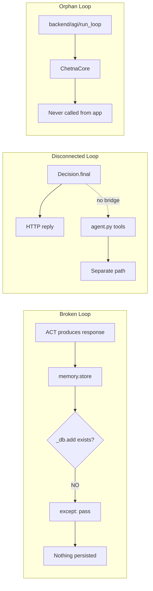

# 06 — AGI Gap Analysis

**Analysis date:** 2026-06-15  
**Method:** Map repository modules to developmental cognitive organism model

---

## A. Intended Cognitive Architecture (inferred from evidence)

From `.agents/memory/chetnaos-arch.md` and `cognitive_cycle.py`:

> ChetnaOS is a **Developmental Cognitive Architecture (Level 6)**. One `CognitiveCycle` per process. Constitution → Organism modules → Orchestrator → Runtime → FastAPI.

**Intended loop:** Perceive → Attend → Recall → Predict → Imagine → Play → Plan → Simulate → Act → Verify → Reflect → Learn → Update Self → Sleep

**Design intent:** A single organism with persistent identity, beliefs, and memory that develops over cycles — not a stateless chatbot.

---

## B. Comparison to Developmental Cognitive Organism

| Organism Function | Biological Analog | ChetnaOS Module | Maturity |
|-------------------|-------------------|-----------------|----------|
| Brainstem / arousal | Existence pulse | `existence.py` | ●○○○○ Minimal counter |
| Mission / telos | Prefrontal values | `purpose.py`, `constitution/` | ●●●○○ Static + refine |
| Sensory cortex | Perception | `perception.py` | ●●○○○ Regex intent only |
| Attention | Thalamus | `attention.py` | ●●○○○ Keyword salience |
| Hippocampus (episodic) | Episodic memory | `experience.py` | ●●○○○ Write-only JSONL |
| Cortex (semantic) | Semantic memory | `beliefs.py`, `memory/db` | ●●●○○ Split stores |
| Working memory | PFC buffer | `memory_hierarchy.py` | ●●○○○ Push only |
| Imagination | Default mode network | `imagination.py` | ●●●○○ LLM conditional |
| Play / exploration | Curiosity system | `play.py` | ●○○○○ No intrinsic drive |
| Abstraction | Concept formation | `abstraction.py` | ●●○○○ Domain/complexity tags |
| World model | Predictive processing | `world_model.py` | ●●○○○ In-memory dict |
| Reasoning | Central executive | `reasoning.py` | ●●●●○ Primary LLM call |
| Planning | Goal-directed action | `planning.py` | ●●●○○ LLM conditional |
| Simulation | Mental rehearsal | `simulation.py` | ●●●○○ Plan A/B/C |
| Decision | Response selection | `decision.py` | ●●○○○ Caveat append only |
| Embodiment | Motor cortex | `embodiment.py` | ○○○○○ **Dead code** |
| Habits | Basal ganglia | `habit.py` | ●●●○○ JSON frequency |
| Reality check | Error monitoring | `reality/` | ●●●○○ Heuristic scoring |
| Reflection | Insula / metacog | `reflection.py` | ●●●○○ Dharma rules |
| Learning | Synaptic plasticity | `learning.py` | ●●○○○ Lesson append |
| Beliefs | World model update | `beliefs.py` | ●●●○○ No formal revision |
| Identity | Self-concept | `identity.py` | ●●●○○ Name/values/tick |
| Development | Maturation | `development.py` | ●●●○○ Cycle stats |
| Homeostasis | Autonomic regulation | `homeostasis.py` | ●●○○○ Threshold alerts |
| Sleep | Consolidation | `sleep.py` | ●●●●○ Dream replay |
| Relationships | Social cognition | `relationship.py` | ●○○○○ User counter |
| Skills | Procedural memory | `skills.py` | ●●●○○ Domain practice |
| Meta-cognition | Self-monitoring | `meta_cognition.py` | ●●●○○ Post-hoc evaluate |
| Founder model | Attachment figure | `founder_context.py` | ●●●●○ Rich context |
| Self-training | Intrinsic motivation | `self_trainer.py` | ●●○○○ Goal generation |
| Contradictions | Cognitive dissonance | `contradiction_tracker` | ●●●○○ Scan only |
| Civilization | Cultural memory | `civilization_memory.py` | ●○○○○ Append only |

Legend: ● = implemented depth (1–5)

---

## C. Existing Modules (A)

**Strong (●●●●+):**
- `cognitive_cycle.py` — full integration
- `founder_context.py` — rich founder model
- `sleep.py` — multi-phase consolidation
- `reasoning.py` — constitution-grounded LLM

**Present but weak (●● or less):**
- `perception.py`, `attention.py`, `play.py`, `relationship.py`
- `embodiment.py` (dead), `decision.py` (caveats only)
- `experience.py` (no retrieval in cycle)

---

## D. Missing Modules (B)

See `03_missing_modules.md`. Critical gaps:

1. **Self model** — MISSING
2. **Curiosity / intrinsic motivation** — MISSING
3. **Emotional model** — MISSING
4. **Social learning** — MISSING
5. **Unified goal manager** — MISSING
6. **Action executor** (wired) — MISSING
7. **Multi-agent layer** — MISSING (empty files)
8. **Test suite** — MISSING

---

## E. Weak Modules (C)

| Module | Weakness |
|--------|----------|
| `memory.py` | Broken `store()` API — vector persistence fails silently |
| `perception.py` | Regex-only intent; no NLU |
| `attention.py` | Keyword salience; no learned weights |
| `play.py` | No connection to curiosity or exploration goals |
| `decision.py` | Appends disclaimers; no multi-candidate selection |
| `relationship.py` | Increments counter; no relationship model |
| `learning.py` | Appends lessons; no retrieval into reasoning |
| `world_model.py` | In-memory only; lost on restart |
| `evolution_engine.py` | Returns static string (orphaned) |
| `dharma_net.py` | Keyword filter (orphaned) |
| `source_ranker.py` | Instantiated, never used |
| `embodiment.py` | Instantiated, never used |

---

## F. Modules to Merge (D)

| Merge | Rationale |
|-------|-----------|
| `workspace.py` + `workspace_state.py` | Duplicate concept |
| `backend/memory.py` + `memory/db.py` + `organism/memory.py` | Triple memory |
| 3× world model | Same name, different semantics |
| `dharma_net` + `reflection_v2` + constitution | Split dharma |
| `purpose` + `self_trainer` | Goal fragmentation |

---

## G. Modules to Delete (E)

| Module | Reason |
|--------|--------|
| Entire `backend/agi/` | Orphaned v0.9 |
| `backend/chetna_core.py` + chain | Superseded by v2 |
| 13 empty scaffold files | Zero implementation |
| `organism/workspace.py` | Orphaned |

---

## H. Architectural Bottlenecks (F)

### 1. God Object: `cognitive_cycle.py` (395 LOC)

- Imports 30+ modules
- Owns all instantiation
- Contains full pipeline logic
- **Bottleneck:** Any change requires editing the monolith

### 2. Dual Architecture Schism

- README + `backend/agi/` describe v0.9
- Live app runs v2 only
- **Bottleneck:** Developer confusion, wasted maintenance

### 3. Silent Failure Pattern

- Widespread `except Exception: pass`
- Memory store bug hidden
- **Bottleneck:** False confidence in system behavior

### 4. LLM as Cognitive Substitute

- Perception, planning, imagination, simulation all defer to LLM when "complex"
- No learned internal models
- **Bottleneck:** No offline cognition; API dependency

### 5. JSON File Proliferation

- 12+ JSON/JSONL files in `memory/`
- No schema validation, no migrations
- **Bottleneck:** Data corruption risk, no atomic transactions

### 6. Broken Cognitive Loop

```
RECALL → uses vector search (works)
ACT → produces response
EXPERIENCE → writes JSONL (works)
memory.store() → FAILS SILENTLY (broken)
SLEEP → reads experiences (works)
```

**Episodic → semantic consolidation pipeline is broken at the store step.**

### 7. Agent Path Disconnected

- `backend/agent.py` (tools: calc, web) runs parallel to cognitive cycle
- No bridge from `Decision` to tool execution
- **Bottleneck:** Two minds in one body

---

## I. AGI Readiness Score (G)

| Dimension | Score (0–10) | Evidence |
|-----------|--------------|----------|
| Architectural completeness | 6 | 35 organism modules exist |
| Integration coherence | 4 | Dual arch, broken memory store |
| Memory systems | 5 | Multiple stores, broken write path |
| Self-model / identity | 5 | Identity exists, self-model missing |
| Learning & adaptation | 4 | Lessons/skills append-only |
| Reality grounding | 6 | Reality layer exists, heuristic |
| Planning & simulation | 6 | Simulation engine present |
| Action & embodiment | 2 | Dead embodiment, separate agent |
| Multi-agent / social | 1 | Empty files |
| Test & validation | 0 | No tests |
| Production readiness | 4 | CORS issues, eval(), no tests |

### **Overall AGI Readiness: 38 / 100**

**Interpretation:** Rich cognitive *scaffolding* with impressive module coverage, but critical wiring bugs, architectural schism, and missing executive/action/social layers prevent this from functioning as a coherent developmental organism.

---

## J. Broken Cognitive Loops (detected)



---

## K. Fake Abstractions (detected)

| Abstraction | Evidence of "fake" |
|-------------|-------------------|
| `EvolutionEngine.adapt()` | Returns static string, no evolution |
| `DharmaFilter.filter()` | Keyword pass-through (orphaned) |
| `Embodiment.act()` | Never invoked |
| `SourceRanker` | Never invoked |
| `backend/agents/*` | Empty files advertised in README |
| `CycleStage.DECIDE` | Enum value with no behavior |
| `Memory.store()` | Calls non-existent API; appears to work |

---

## L. Meta-Cognition Assessment

`meta_cognition.py` exists and runs at SELF_QUESTION stage. It evaluates correctness post-hoc but:

- Does not feed back into next cycle's attention or planning
- Does not trigger belief revision engine (missing)
- Stores to JSONL but is not recalled in RECALL stage

**Verdict:** Meta-cognition is **observational**, not **corrective**.
