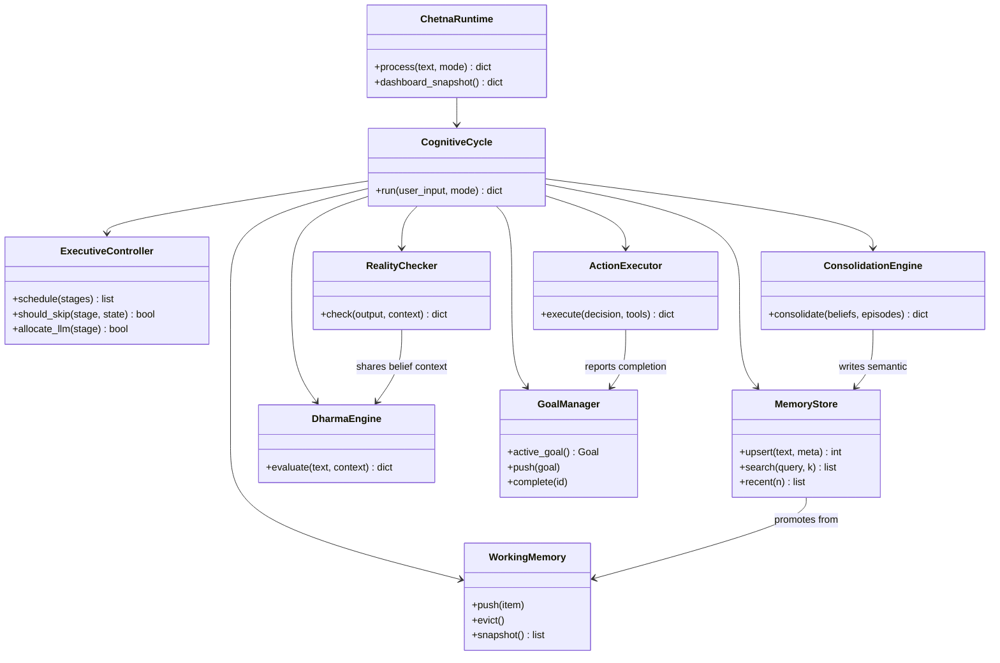
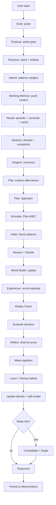
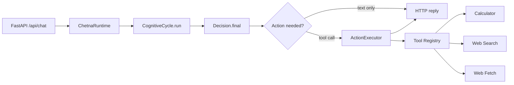
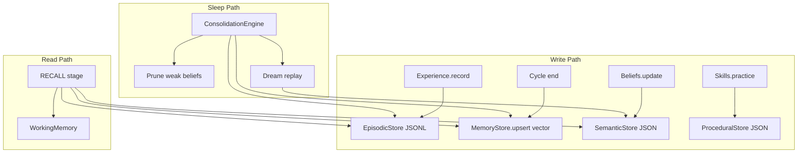
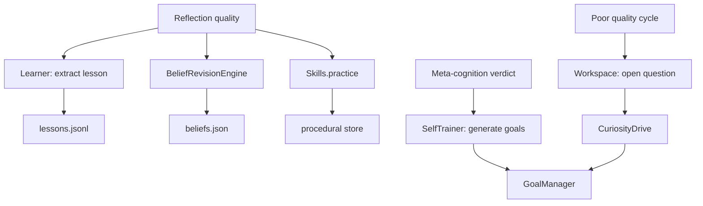

# 07 — Target Architecture

**Analysis date:** 2026-06-15  
**Principle:** Simplicity over complexity. One organism, one loop, one memory, one entry.

Redesign from first principles — **does not preserve** inferior v0.9 `backend/agi/` or empty scaffolds.

---

## A. Design Principles

1. **Single cognitive kernel** — one executive, one cycle, one runtime
2. **Layered memory** — working → episodic → semantic → procedural (not 12 JSON files + 2 SQLite schemas)
3. **Thin HTTP shell** — `infrastructure/` owns FastAPI; cognition is framework-agnostic
4. **Explicit pipelines** — cognitive, memory, learning, execution are separate documented flows
5. **Fail loud** — no silent `except: pass` on persistence
6. **Testable units** — every module importable and testable in isolation

---

## B. Target Folder Tree

```
chetnaos/
├── organism/                    # Lifecycle, homeostasis, development
│   ├── __init__.py
│   ├── existence.py             # Pulse, cycle counter
│   ├── development.py           # Maturation metrics
│   ├── homeostasis.py           # Stress detection
│   └── sleep_scheduler.py       # When to sleep (from sleep_manager)
│
├── cognition/                   # Perception → reasoning pipeline
│   ├── __init__.py
│   ├── perception.py
│   ├── attention.py
│   ├── abstraction.py
│   ├── imagination.py
│   ├── play.py
│   ├── reasoning.py
│   ├── decision.py
│   ├── executive.py             # NEW — stage gating, interrupts
│   ├── self_model.py            # NEW
│   ├── curiosity.py             # NEW
│   └── emotion.py               # NEW
│
├── memory/                      # Unified memory subsystem
│   ├── __init__.py
│   ├── store.py                 # Single MemoryStore (SQLite + embeddings)
│   ├── working_memory.py        # NEW — bounded buffer
│   ├── episodic.py              # From experience.py
│   ├── semantic.py              # From beliefs + lessons
│   ├── procedural.py            # From skills + habits
│   ├── hierarchy.py             # From memory_hierarchy
│   └── consolidation.py         # From sleep.py
│
├── identity/                    # Self-representation
│   ├── __init__.py
│   ├── identity.py
│   ├── beliefs.py
│   ├── belief_revision.py       # NEW
│   └── founder_model.py         # From founder_context.py
│
├── values/                      # Constitution + dharma
│   ├── __init__.py
│   ├── constitution.py          # Merged mission/values/ethics
│   ├── dharma_engine.py         # Merged reflection_v2 + scoring
│   └── rules/                   # dharma_rules.json
│
├── world_model/                 # External state representation
│   ├── __init__.py
│   └── engine.py                # From organism/world_model.py
│
├── simulation/                  # Mental rehearsal
│   ├── __init__.py
│   └── engine.py                # From simulation.py
│
├── planning/                    # Goals and plans
│   ├── __init__.py
│   ├── planner.py               # From planning.py
│   ├── goal_manager.py          # NEW — merges purpose + self_trainer
│   └── purpose.py               # Telos / mission refinement
│
├── action/                      # Motor output + tools
│   ├── __init__.py
│   ├── executor.py              # NEW — bridges to tools
│   └── embodiment.py            # Response formatting
│
├── learning/                    # Adaptation
│   ├── __init__.py
│   ├── learner.py               # From learning.py
│   ├── skills.py
│   ├── self_trainer.py
│   └── social_learning.py       # NEW
│
├── meta_cognition/              # Self-monitoring
│   ├── __init__.py
│   ├── evaluator.py             # From meta_cognition.py
│   └── reflection.py            # Wraps dharma_engine post-hoc
│
├── reality/                     # Grounding + verification
│   ├── __init__.py
│   ├── checker.py               # RealityChecker
│   ├── confidence.py
│   ├── evidence.py
│   ├── truth.py
│   ├── belief_validator.py
│   ├── contradiction.py         # Merged detector + tracker
│   └── source_ranker.py
│
├── agents/                      # Specialized agents (when needed)
│   ├── __init__.py
│   ├── chat.py                  # From backend/agent.py tools
│   └── registry.py              # Tool registry
│
├── tools/                       # External capabilities
│   ├── __init__.py
│   ├── calculator.py
│   ├── web_search.py
│   └── web_fetch.py
│
├── workspace/                   # Cognitive workspace
│   ├── __init__.py
│   ├── manager.py               # From workspace_state.py
│   └── artifacts.py
│
└── infrastructure/              # Deployment shell
    ├── __init__.py
    ├── app.py                   # FastAPI (from backend/app.py)
    ├── config.py
    ├── runtime.py               # ChetnaRuntime singleton
    ├── cognitive_cycle.py       # Slim orchestrator (delegates to executive)
    ├── state_machine.py
    ├── llm_router.py
    └── plugins/
        └── kalpavriksha/        # Domain plugin (unchanged)
```

---

## C. Module Tree (class-level)

```
ChetnaRuntime
└── CognitiveCycle
    ├── ExecutiveController          # cognition/executive.py
    ├── StateMachine                 # infrastructure/state_machine.py
    ├── LLMRouter                    # infrastructure/llm_router.py
    ├── SleepScheduler               # organism/sleep_scheduler.py
    │
    ├── Perception                   # cognition/perception.py
    ├── Attention                    # cognition/attention.py
    ├── WorkingMemory                # memory/working_memory.py
    ├── MemoryStore                  # memory/store.py
    │   ├── EpisodicStore            # memory/episodic.py
    │   ├── SemanticStore            # memory/semantic.py
    │   └── ProceduralStore          # memory/procedural.py
    ├── Abstraction                  # cognition/abstraction.py
    ├── Imagination                  # cognition/imagination.py
    ├── Play                         # cognition/play.py
    ├── CuriosityDrive               # cognition/curiosity.py
    ├── Planner                      # planning/planner.py
    ├── SimulationEngine             # simulation/engine.py
    ├── Reasoning                    # cognition/reasoning.py
    ├── Decision                     # cognition/decision.py
    ├── ActionExecutor               # action/executor.py
    ├── WorldModelEngine             # world_model/engine.py
    ├── RealityChecker               # reality/checker.py
    ├── Reflection                   # meta_cognition/reflection.py
    ├── MetaEvaluator                # meta_cognition/evaluator.py
    ├── Learner                      # learning/learner.py
    ├── BeliefRevisionEngine         # identity/belief_revision.py
    ├── Identity                     # identity/identity.py
    ├── FounderModel                 # identity/founder_model.py
    ├── GoalManager                  # planning/goal_manager.py
    ├── ConsolidationEngine          # memory/consolidation.py
    ├── SelfModel                    # cognition/self_model.py
    ├── EmotionalState               # cognition/emotion.py
    ├── WorkspaceManager             # workspace/manager.py
    ├── DharmaEngine                 # values/dharma_engine.py
    └── Constitution                 # values/constitution.py
```

---

## D. Class Diagram



---

## E. Cognitive Pipeline



**LLM gates (executive decides):**
- IMAGINE: complexity == complex
- PLAN: complexity == complex
- SIMULATE: complexity == complex
- ACT (Reasoning): always

---

## F. Execution Pipeline



**Key change:** `backend/agent.py` tools move to `tools/` and are invoked by `ActionExecutor` when decision contains tool intent — not a parallel chat path.

---

## G. Memory Pipeline



**Fix:** Replace broken `_db.add()` with `MemoryStore.upsert()`. Add `recent()` for temporal recall.

---

## H. Learning Pipeline



---

## I. Simplifications vs Current Design

| Current | Target | Why |
|---------|--------|-----|
| `src/chetnaos/organism/` (35 files flat) | 14 domain packages | Cognitive clarity |
| `backend/` + `src/` split | `chetnaos/` single package | One import root |
| 3 memory modules | 1 `MemoryStore` | Fix broken store |
| 3 world models | 1 `WorldModelEngine` | Eliminate confusion |
| `cognitive_cycle` god object | `ExecutiveController` + slim cycle | Testability |
| 13 empty agent files | Delete until needed | Honest architecture |
| `backend/agi/` loop | Delete | Superseded |
| JSON files scattered | `memory/` package owns all persistence | Single owner |

---

## J. Package Import Root

```python
# Target import style (no sys.path hacks)
from chetnaos.infrastructure.runtime import ChetnaRuntime
from chetnaos.memory.store import MemoryStore
from chetnaos.cognition.executive import ExecutiveController
```

Install via `pyproject.toml` with `packages = ["chetnaos"]`.
